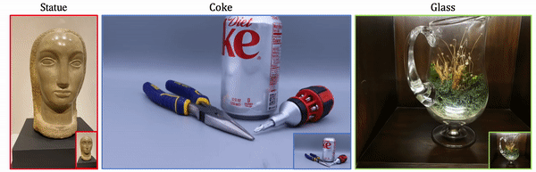

#  [NeuLF: Efficient Novel View Synthesis with Neural 4D Light Field](https://lizhong3232.github.io/neulf/)  
## Eurographics Symposium on Rendering(EGSR)2022 
[Zhong Li](https://sites.google.com/site/lizhong19900216)<sup>1</sup>,
 [Liangchen Song](https://lsongx.github.io/)<sup>2</sup>,
 [Celong Liu](https://www.cct.lsu.edu/~cliu/)<sup>1</sup>,
 [Junsong Yuan](https://cse.buffalo.edu/~jsyuan/)<sup>2</sup>,
 [Yi Xu](https://www.linkedin.com/in/yi-xu-42654823/)<sup>1</sup>,  
 <sup>1</sup>OPPO US Research Center, <sup>2</sup>University at Buffalo
  

<p align="center">
  
</p>

> We present an efficient and robust deep learning solution for novel view synthesis of complex scenes. In our approach, a 3D scene is represented as a light field, i.e., a set of rays, each of which has a corresponding color when reaching the image plane. For efficient novel view rendering, we adopt a two-plane parameterization of the light field, where each ray is characterized by a 4D parameter. We then formulate the light field as a 4D function that maps 4D coordinates to corresponding color values.


### [Project Page](https://oppo-us-research.github.io/NeuLF-website/) | [Paper](https://arxiv.org/pdf/2105.07112.pdf)
[NeuLF](https://oppo-us-research.github.io/NeuLF-website/) (Neural 4D Light Field) is a method that achieves state-of-the-art results for synthesizing novel views of complex scenes. Here are some videos generated by this repository (pre-trained models are provided below):

<!--  -->

<p align="center">
  
</p>


This project is an official PyTorch implementation of [NeuLF](https://lizhong3232.github.io/neulf/) that **reproduces** the results. 


# Installation

```
git clone https://github.com/oppo-us-research/NeuLF.git
cd NEULF_PUBLIC
conda env create -n neulf --file enviroment.yml
```


You will also need the [LLFF code](http://github.com/fyusion/llff) (and COLMAP) set up to compute poses if you want to run on your own real data.
  


# How To Run?

### Quick demo
We have a pretrain model on `Ollie` data in `result/Exp_Ollie_d8_w256/checkpoints/`.

To process the raw data, run
```
python src/llffProcess.py --data_dir dataset/Ollie --factor 4
```
and you will get the `UVST` and `rgb_values` related `.npy` files in `./dataset/Ollie/`.

To visualize our pretrain model on `Ollie` dataset, run

```
python src/demo_rgb.py --exp_name Ollie_d8_w256 --data_dir dataset/Ollie/
```

After running the above script, you can get both `gif` and `mp4` at `./demo_result_rgb/Exp_Ollie_d8_w256/`, similar to this:

<p align="center">
  
</p>

### Dataset and Training
We have data for three example datasets located in dataset folder `./dataset/Ollie` , `cokeclip` and `statue0`. 
```
├── dataset 
│   ├── cokeclip
|       ├── images_4
│   ├── statue0   
│   ├── Ollie    
```

For each data, to train a `NeuLF`, let take `CanClip` as an example:

First, we need to convert the data into `UVST`,`rgb_values` and `Renderpose`:

```
python src/llffProcess.py --data_dir dataset/CanClip --factor 4
```

After that, you could see `.npy` files in dataset folder.

Then, for training, run:

```
python src/train_neulf.py --data_dir dataset/CanClip --exp_name CanClip_d8_w256
```

After training for 120 epochs (~20 minutes on a single 3090), you can find the `mp4` and `gif` animation results at `Exp_cokeclip_d8_w256/`, including results on both `training` and `testing` views.


# Generating poses for your own scenes

## Don't have poses?
We recommend using the `imgs2poses.py` script from the [LLFF code](http://github.com/fyusion/llff) (and COLMAP) code. Then you can pass the base scene directory into our code using `--datadir <myscene>` along with -dataset_type llff. Then put the images along with `poses_bounds.npy` under the `./datasets` folder, and following the format like others in `./dataset/` folder.

Then, for training, run:

```
python src/train_neulf.py --data_dir dataset/$dataname$ --exp_name dataname_d8_w256
```


# Citation
```
@inproceedings {li2022neulf,
                booktitle = {Eurographics Symposium on Rendering},
                title = {NeuLF: Efficient Novel View Synthesis with Neural 4D Light Field},
                author = {Li, Zhong and Song, Liangchen and Liu, Celong and Yuan, Junsong and Xu, Yi},
                year = {2022},
            }
}
```

```
@article{li2021neulf,
                title={NeuLF: Efficient Novel View Synthesis with Neural 4D Light Field},
                author={Li, Zhong and Song, Liangchen and Liu, Celong and Yuan, Junsong and Xu, Yi},
                journal={arXiv e-prints},
                pages={arXiv--2105},
                year={2021}
              }
```

The `src/load_llfff.py` is from implementation [here](https://github.com/bmild/nerfs).

```
@inproceedings{mildenhall2020nerf,
  title={NeRF: Representing Scenes as Neural Radiance Fields for View Synthesis},
  author={Ben Mildenhall and Pratul P. Srinivasan and Matthew Tancik and Jonathan T. Barron and Ravi Ramamoorthi and Ren Ng},
  year={2020},
  booktitle={ECCV},
}
```